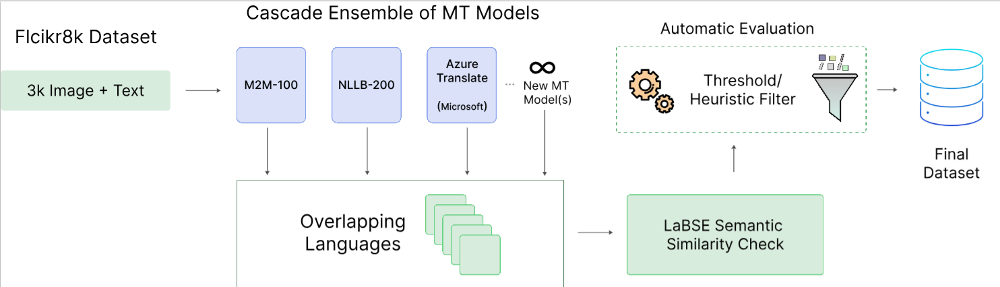

## AFRICAPTION

### Architecture

<p align="center">
  
</p>

This pipeline is designed to preserve and leverage conversational context across turns, enabling consistent, factual, and stylistically coherent outputs over extended interactions. It integrates retrieval-augmented context encoding with disciplined prompt construction and safety-aware decoding to minimize drift, reduce hallucinations, and retain salient entities and relations over time.

### Project Structure

```
Cxt-pres-pipeline/
├── africaption/          # Main package module
│   ├── __init__.py      # Package initialization and exports
│   ├── config.py        # Configuration constants and baseline definitions
│   ├── translators.py   # Translation adapter classes (Marian, NLLB-like)
│   ├── scorer.py        # Semantic similarity scoring (LaBSE)
│   ├── dataset.py       # Dataset loading and utilities
│   ├── adapter_loader.py # YAML configuration loader
│   ├── pipeline.py      # Main processing pipeline
│   └── cli.py           # Command-line interface
├── config/              # Configuration files
│   ├── models_multilingual.yaml
│   └── models_marian.yaml
├── outputs/             # Generated output files
├── main.py              # Entry point script
├── test.py              # Quick test script (5 samples)
├── run.py               # Full dataset processing script
└── README.md
```

### Features

- **Context acquisition and normalization**: Curates inputs (transcripts, captions, metadata) and performs robust preprocessing to standardize signals while retaining temporal structure.
- **Memory and retrieval**: Encodes session history and salient entities; retrieves only the most decision-relevant context to control prompt length and latency.
- **Prompt orchestration**: Assembles declarative constraints, factual anchors, and user intent into a stable instruction scaffold that is resilient to domain shift.
- **Generation with safeguards**: Applies calibrated decoding, confidence cues, and refusal heuristics for sensitive or uncertain content.
- **Evaluation and refinement**: Monitors coherence, factuality, and style adherence; supports human-in-the-loop review for continuous improvement.

### Quick Start

**Test with 5 samples:**
```bash
python test.py
```

**Process entire dataset:**
```bash
python run.py
```

**Custom usage:**
```bash
python main.py --test                                    # Test mode
python main.py --models-yaml config/models.yaml         # Custom config
python main.py --out-dir custom_outputs                 # Custom output
```

### Usage

The pipeline automatically:
- Detects model configuration files (`config/models_multilingual.yaml` by default)
- Identifies language overlaps between dataset and models
- Compares translation quality via semantic similarity (LaBSE)
- Retains higher-scoring translations (old or new)
- Generates outputs in JSONL and Parquet formats with audit trails

### Configuration

Model configurations are defined in YAML files under `config/`:

**Multilingual NLLB-like model:**
```yaml
type: "nllb_like"
model: "facebook/nllb-200-distilled-600M"
lang_tokens:
  afr: "afr_Latn"
  amh: "amh_Ethi"
  ...
```

**Per-language Marian models:**
```yaml
models:
  afr: "Helsinki-NLP/opus-mt-en-af"
  amh: "Helsinki-NLP/opus-mt-en-am"
  ...
```

### Output

The pipeline generates:
- `outputs/afrimmd_updated.jsonl` - JSONL format with audit trail
- `outputs/afrimmd_updated.parquet` - Parquet format for analysis

Each record includes an `_audit` field with translation quality scores and retention decisions.
